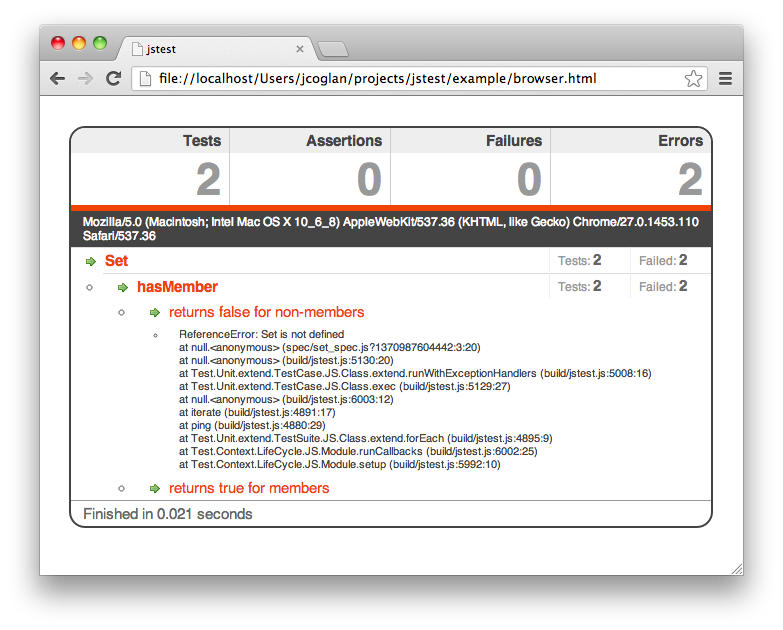
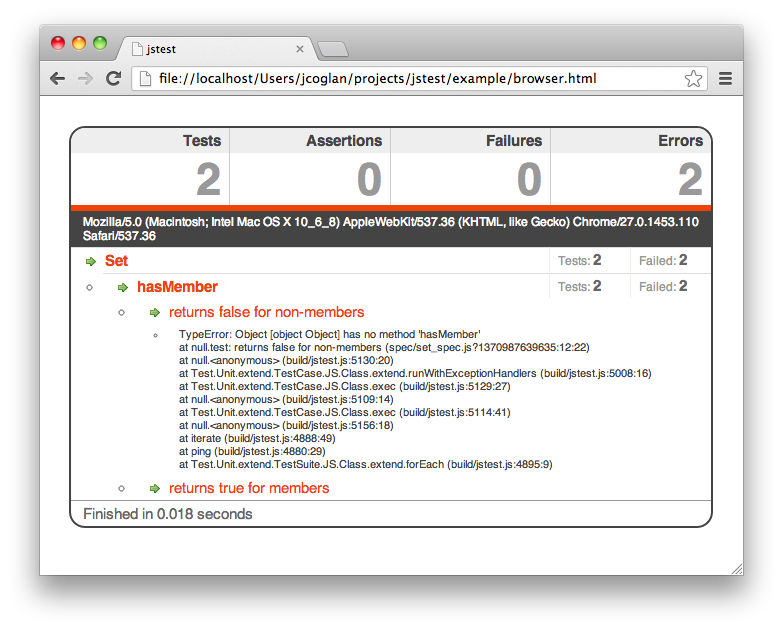
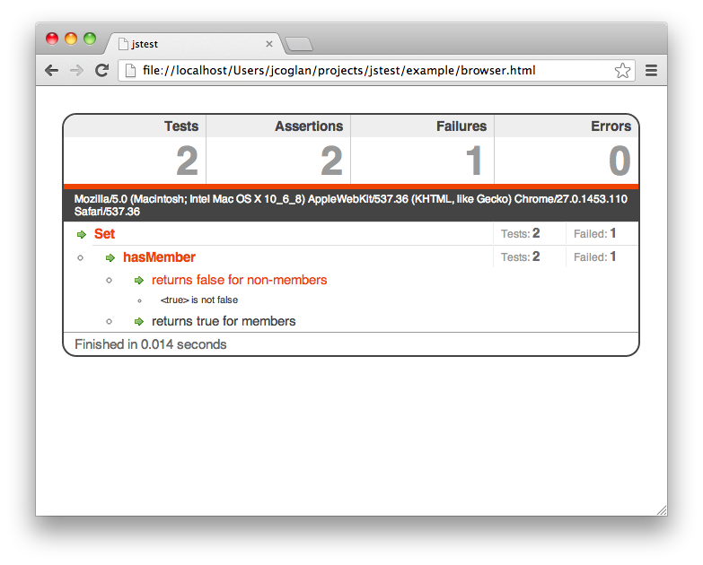
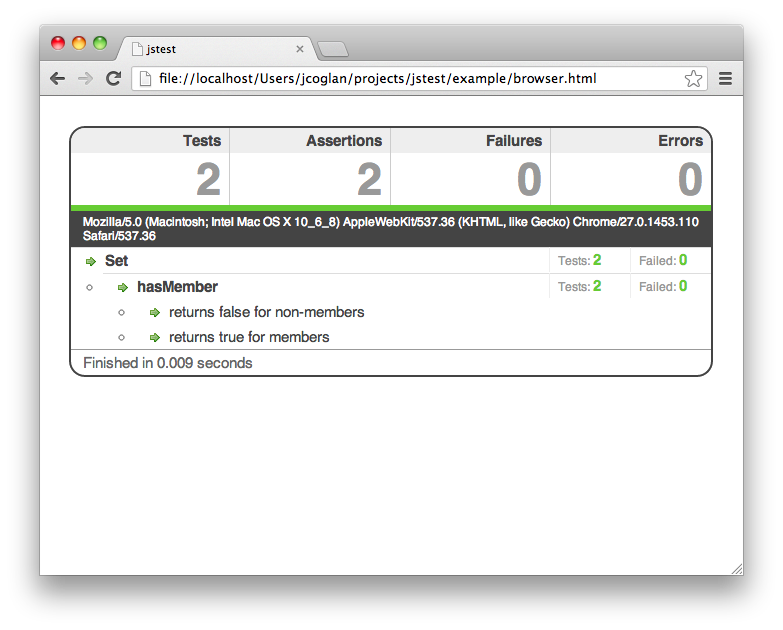

# jstest - 入门指南 #

### 概述 ###

在这部教程中将学习到如何使用 **jstest** 来编写和在浏览器中执行第一个测试用例。让我们先编写一个我们想要的简单用例，例如，`Set` 数据结构的实现。`Set` 类要确保存储一个没有重复的字符串集合，并检测某个字符串是否存在该集合之中。

接下来，我们创建一些项目目录(如果想要下载最终的实例可以从github上pull)。先下载 `jstest` 并存储到 `build/` 目录中，然后按照如下所示创建目录：

	build/
	    jsbuild.js
	example/
	    browser.html
	    lib/
	        set.js
	    spec/
	        set_spec.js

#### 编写用例 ####

首先在项目中创建一个用例 `spec/set_spec.js` 。测试用例通过 `JS.Test.describe()` 方法来调用，然后在其中编写测试语句。

	// example/spec/set_spec.js
	
	JS.Test.describe('Set', function() { with(this) {
	  before(function() { with(this) {
	    this.set = new Set(['foo'])
	  }})
	
	  describe('hasMember', function() { with(this) {
	    it('returns true for members', function() { with(this) {
	      assert( set.hasMember('foo') )
	    }})
	
	    it('returns false for non-members', function() { with(this) {
	      assertNot( set.hasMember('bar') )
	    }})
	  }})
	}})

#### 设置测试页面 ####

前面我们已经为类中方法编写了一个简单的用例了，那么现在我们需要让它运行起来。要实现这个目的，我们需要创建一个页面 `browser.html` 。它要做的是加载 `jsbuild` 和我们的代码，测试等，然后通过 `JS.Test` 运行测试用例：

	<!-- example/browser.html -->
	
	<!doctype html>
	<html>
	  <head>
	    <meta http-equiv="Content-Type" content="text/html; charset=utf-8">
	    <title>jstest</title>
	  </head>
	  <body>
	
	    
	    
	    
	
	    
	
	  </body>
	</html>

如果你不太喜欢那另人“烦躁”的 `script` 标签的话，你可以使用任意的你所中意的模块加载器； `jstest` 不关心是如何加载代码的。

这时，当你在浏览器中打开这个页面时你将会看到如下图所示。可以点击测试名称来展开查看每个失败用例的具体信息。

#### 调整测试 ####

好的，我们看到提示中 `Set` 未定义，因为我们还没有编写任何代码，所以接下来让我们在 `lib/set.js` 中添加一些代码然后解决报错：

	// example/lib/set.js
	
	var Set = function() {}

重新载入页面，这时会出现一个不同的错误：

稍微好了一点，但是我们还需要再添加忽略的方法。让我们添加一些代码来解决这个错误吧：

	// example/lib/set.js
	
	var Set = function() {}
	
	Set.prototype.hasMember = function() {
	  return true
	}

这时测试中的一个通过了测试，但是还有一个失败：

最后，让我们把所有需要的逻辑补充完整，让测试成功通过：

	// example/lib/set.js
	
	var Set = function(members) {
	  this._members = {}
	  for (var i = 0, n = members.length; i < n; i++) {
	    this._members[members[i]] = true
	  }
	}
	
	Set.prototype.hasMember = function(value) {
	  return this._members.hasOwnProperty(value)
	}

最后，当我们再次载入这个页面时我们看到的是所有测试都通过了：

